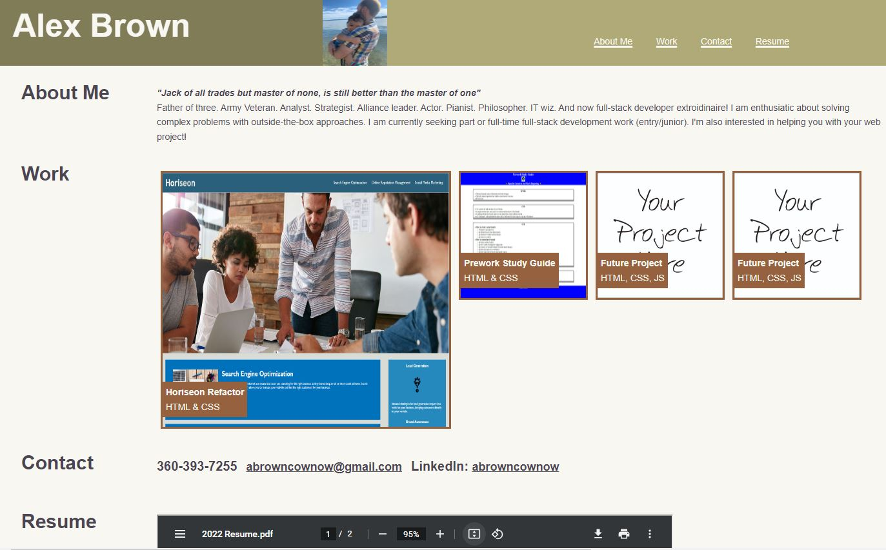

# Alex Brown's Portfolio Page

## Description

Personal portfolio site dedicated to showcasing web programming projects. Includes:

- Navigation bar with links
- Short about me section.
- Dynamic gallery of previous web projects.
- Resume viewable through PDF iframe.
- Page contents adjust dynamically depending on viewport size.
- Future projects button that links to a [contact form](https://docs.google.com/forms/d/e/1FAIpQLSflqCKnu1E5u79jBKE-hVoQX1rIDpuT1Q1sjo289B5HisFS-Q/viewform)
- Deployed to github for public use at [https://abrowncownow.github.io/portfolio/index.html](https://abrowncownow.github.io/portfolio/index.html)
- Repo can be viewed at [https://github.com/abrowncownow/portfolio](https://github.com/abrowncownow/portfolio)

## Table of Contents

Use the links below to navigate to different sections of the README.

- [Installation](#installation)
- [Usage](#usage)
- [Credits](#credits)
- [License](#license)

## Installation

Website deployed to web via github pages. No installation necessary.

## Usage

Navigate to page in browser. Navigation menu links to various places on the website. Portfolio examples link to the deployed project. Future projects links to a contact form. Portfolio examples glow on hover. Contact email activates mailto in default email client. Resume pdf viewable through document viewer which includes zoom and print functions.

## Credits

Developed by Alex Brown. Color Pallete generated using colormind.

## License

Please refer to the LICENSE in the repo.